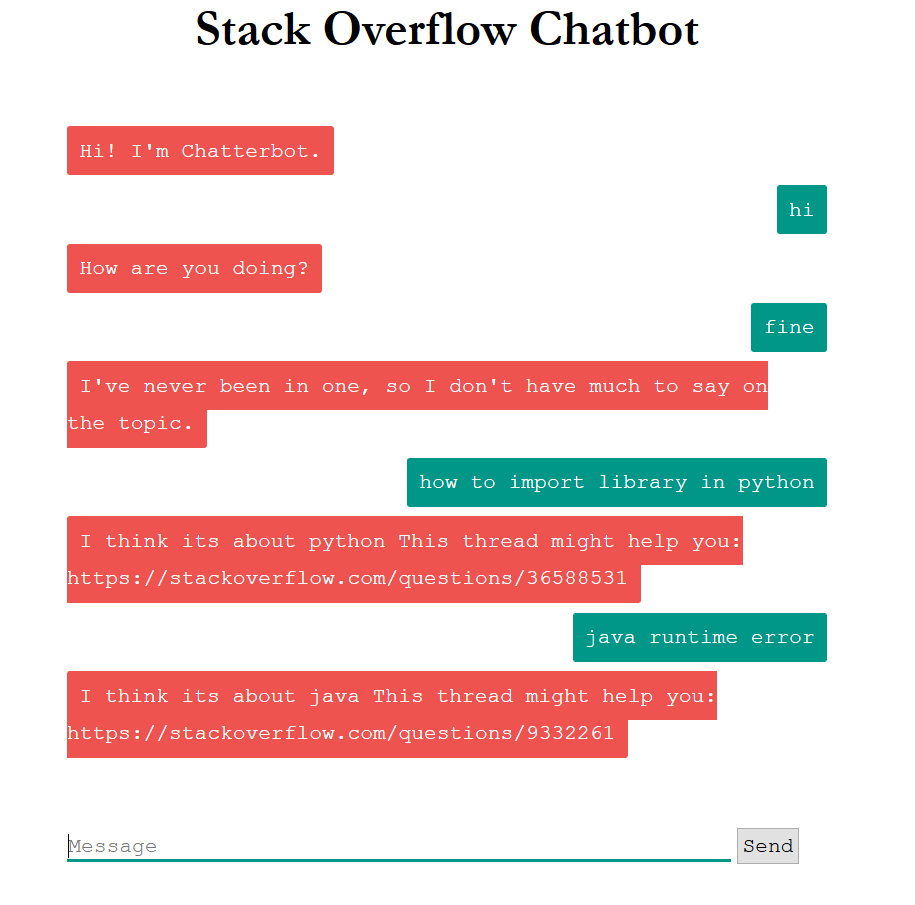

# StackOverflowBot
Custom Conversational Bot built to assist users in querying StackOverflow questions 

This is a Flask Application, which provides the user with a intercative UI to chat with bot

Here is an sample of the Application.

<!-- .element height="30%" width="30%" -->
